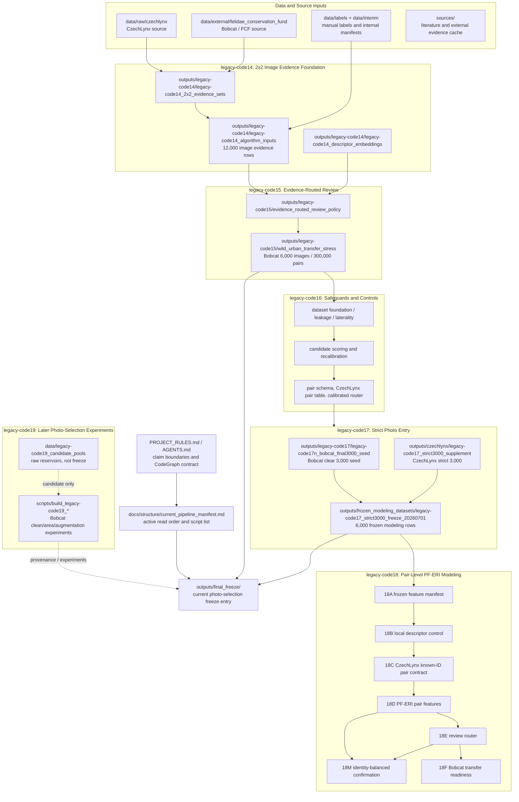
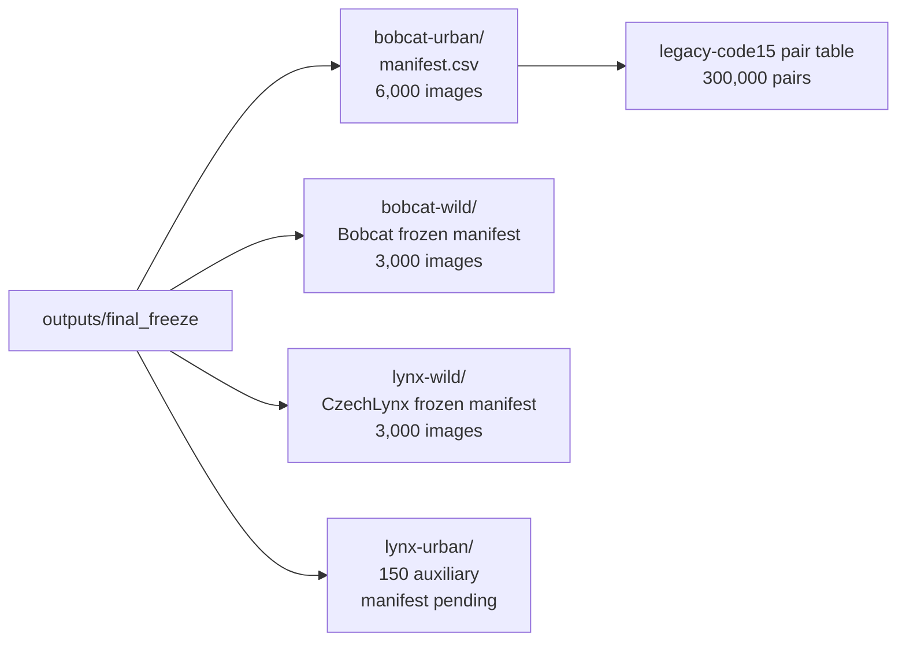
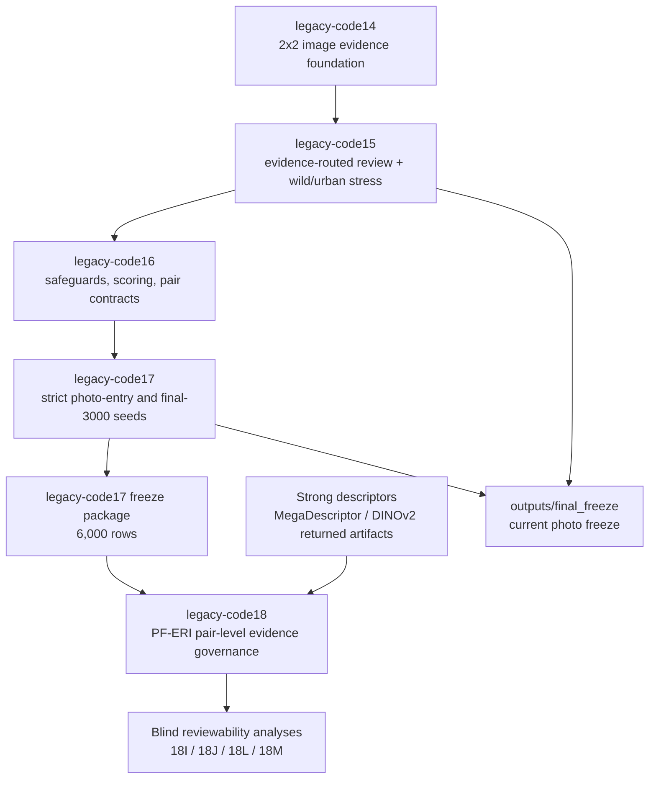
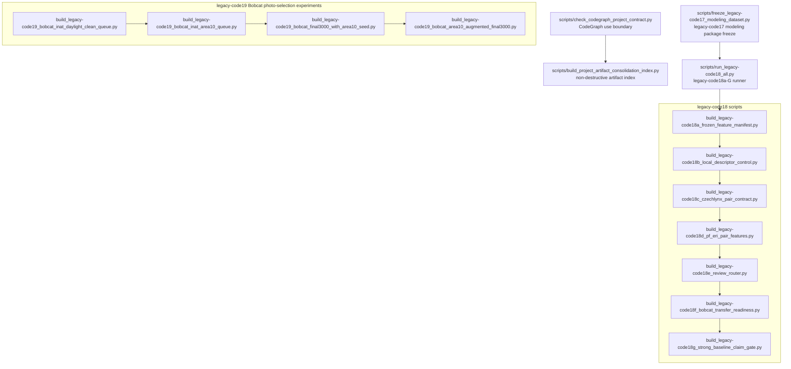

# CodeGraph Project Structure Map

Date: 2026-07-07

This map uses CodeGraph for code-navigation structure and direct manifest
checks for data state. CodeGraph is used to answer where code lives and how
scripts relate. CSV/JSON manifests remain the source of truth for counts,
photo-selection state, freeze status, and scientific boundaries.

## Executive Map

## Current Final Freeze

Use `outputs/final_freeze/` as the current navigation layer.

Validated freeze counts:

| Freeze scope | Rows | Source |
| --- | ---: | --- |
| `bobcat-urban` | 6,000 images | `outputs/final_freeze/bobcat-urban/manifest.csv` |
| `bobcat-urban-pairs` | 300,000 pairs | `outputs/legacy-code15/wild_urban_transfer_stress/legacy-code15e_bobcat_evidence_routed_review_table.csv` |
| `bobcat-wild` | 3,000 images | `outputs/frozen_modeling_datasets/legacy-code17_strict3000_freeze_20260701/manifests/bobcat_frozen_manifest.csv` |
| `lynx-wild` | 3,000 images | `outputs/frozen_modeling_datasets/legacy-code17_strict3000_freeze_20260701/manifests/czechlynx_frozen_manifest.csv` |
| `lynx-urban` | 150 images | plan-complete auxiliary, manifest pending archival |

## Phase Flow

## CodeGraph Script Backbone

CodeGraph identified these as the active backbone or navigation/guardrail
scripts. Broad CodeGraph queries can retrieve legacy or experimental scripts,
so exact paths remain preferred once known.

## Directory Roles

| Path | Role | Use now |
| --- | --- | --- |
| `outputs/final_freeze/` | Current freeze entry point | Yes, primary navigation |
| `outputs/frozen_modeling_datasets/legacy-code17_strict3000_freeze_20260701/` | Stable 3,000 Bobcat + 3,000 CzechLynx modeling package | Yes, source of truth for frozen 6,000 package |
| `outputs/legacy-code14/legacy-code14_algorithm_inputs/` | 12,000-row 2x2 image evidence table and pair comparability | Yes, provenance and legacy-code15 input |
| `outputs/legacy-code15/wild_urban_transfer_stress/` | Bobcat urban/peri-urban transfer-stress pair outputs | Yes, pair-level stress source |
| `outputs/legacy-code16/` | Safeguards, scoring, pair contracts, calibrated controls | Yes, provenance/control layer |
| `outputs/legacy-code17/` | Bobcat final seed and strict review history | Yes, provenance; avoid treating all subdirs as current |
| `outputs/czechlynx/legacy-code17_strict3000_supplement/` | CzechLynx strict 3,000 rebuild and augmentation | Yes, provenance for lynx wild freeze |
| `outputs/legacy-code18/` | Pair-level modeling, strong descriptor controls, reviewability analyses | Yes, current algorithmic evidence layer |
| `outputs/legacy-code19/` | Later Bobcat photo-selection experiments | Conditional; not a stable freeze source unless manifest exists and is indexed |
| `data/legacy-code19_candidate_pools/` | Raw candidate reservoirs | No final claims; candidate only |
| `sources/` | Literature/source cache | Citation support, not model output |
| `colab/` | GPU/Colab training and strong-model packages | Runtime support/provenance |
| `scripts/prototypes/` | Throwaway or exploratory logic | Provenance only unless promoted and documented |

## Claim Boundaries

- PF-ERI is a post-retrieval pair-level evidence-governance and review-routing
  layer.
- It is not a descriptor replacement.
- It is not automatic identity recognition.
- Bobcat material is not verified individual identity evidence unless separate
  identity labels or audited same/different pair labels are added.
- `lynx-urban` is a 150-image auxiliary note, not a 3,000-image main cell.
- CodeGraph can locate and trace code; it cannot decide photo validity, CSV
  counts, phase completion, or final scientific claims.

## Practical Navigation

Start here:

1. `outputs/final_freeze/README.md` for current photo freeze.
2. `docs/structure/current_pipeline_manifest.md` for active scripts and read
   order.
3. `docs/legacy-code18/README.md` for current pair-level modeling status.
4. `outputs/legacy-code18/legacy-code18m_identity_balanced_analysis/` for the strongest
   current blind-confirmed reviewability result.
5. `outputs/project_structure/codegraph_contract/` and
   `outputs/project_structure/artifact_consolidation_index/` for structure
   guardrails.

