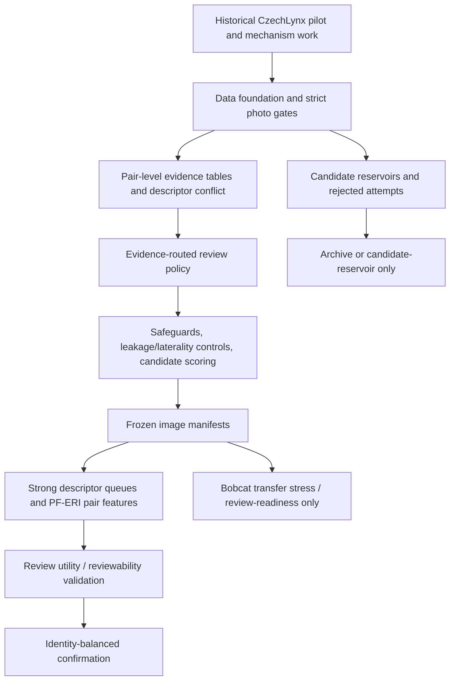

# Content-Based Reorganization Plan

Date: 2026-07-07

Purpose: replace the confusing legacy-code mental model with a content-based project map. Numeric labels remain provenance labels only; they should not be the way we navigate the project.

Execution status: repo-wide content renaming has been applied with content-based directories and compatibility symlinks. See `content_directory_migration_map.csv` and `content_subdirectory_migration_map.csv` for old-path to new-path mappings.

This document is non-destructive. It proposes a freeze/navigation structure and
a cleanup policy. Do not move or delete large artifacts until the manifest/index
for that content area exists and the user has approved the migration.

## One-Sentence Project Shape

The project is not a numbered ladder. It is:

```text
photo/data foundation
-> pair-level evidence features
-> review-routing and risk governance
-> strong-baseline / identity-balanced validation
-> final frozen photo sets and manuscript-ready claims
```

PF-ERI is a post-retrieval pair-level evidence reliability and review-routing
layer. It is not a descriptor replacement, not automatic identity assignment,
and not Bobcat identity accuracy without verified Bobcat identity or audited
same/different pair labels.

## Current Content Graph



## Legacy Codes Translated Into Content

The stable repository evidence starts around the CzechLynx pilot and visual-mechanism outputs. Legacy codes 1-3 do not currently have clean standalone entry folders in the same way later work does, so they should be treated as early pilot/triage history unless a specific artifact is needed.

| Legacy code | Content name | What we were doing | Current role |
| --- | --- | --- | --- |
| codes 1-3 | Early CzechLynx pilot, triage, blinding setup | Initial review design, triage consistency, small blinded subsets, and early feasibility checks. | Historical provenance only. Do not use as current navigation. |
| code 4 | Visual mechanism and descriptor-similarity mechanism study | 500-image CzechLynx mechanism annotations, 3,000 known-ID pair mechanism table, ResNet50/MegaDescriptor similarity, mechanism/policy/uncertainty outputs. | Historical scientific foundation. Explains why pair-level visual evidence matters. |
| code 5 | Early ERI policy-frontier validation | ERI bands, similarity baselines, and reliability-retention/frontier ideas. | Historical rationale for risk/coverage framing. |
| code 6 | Blinded annotation and PF-ERI control foundation | Blinded CzechLynx image review workflow, visual evidence factors, early open-set/risk ideas. | Historical rationale only. |
| code 7 | Embeddings and visual/descriptor PF-ERI prototypes | Early embedding extraction, visual-only vs descriptor-supported PF-ERI, pair tables, policy optimization. | Prototype layer; useful only if tracing method evolution. |
| code 8 | Retrieval-control diagnostics | Fixed-descriptor retrieval benchmarks, policy frontiers, downstream sensitivity, cautionary baseline work. | Historical evidence and cautionary baseline. |
| code 9 | Evidence-utility reranking | No-training PF-ERI-aware reranking around fixed descriptors; recognized image filtering alone was insufficient. | Bridge toward pair-level evidence learning. |
| code 10 | Lightweight metric-learning bridge | Archived metric-learning / projection-head feasibility work. | Archive. Not the main claim. |
| code 11 | Pair-level learning diagnostics | Pair reliability math, positive-pair weighting, hard-negative/reliability ideas. | Diagnostic foundation, not active training endpoint. |
| code 12 | Pairwise evidence research-question foundation | RQ1-RQ4, candidate/pair tables, descriptor-evidence conflict, risk-coverage framing. | Research-question foundation. |
| code 13 | Learned utility and training caution | Learned candidate utility and fixed-embedding projection-head controls; found naive training can damage descriptor geometry. | Explains why training is not the current main path. |
| code 14 | Data foundation and 2x2 evidence sets | Built same-genus wild/urban x high/low evidence foundation, image evidence tables, pair comparability, descriptor conflict, statistical analysis. | Active data-foundation provenance. |
| code 15 | Evidence-routed review layer | After descriptor retrieval, decide whether candidate pairs are admissible/review/defer/species-level/non-comparable. Includes CzechLynx validation and Bobcat transfer stress. | Core empirical review-routing evidence. |
| code 16 | Safeguards, scoring, pair contract, claim lock | Dataset audits, laterality/leakage controls, strong-model benchmark prep, candidate scoring, CzechLynx constrained selection, pair feature schema, calibrated router diagnostics, claim-lock decision. | Governance and guardrail layer. |
| code 17 | Review-utility validation and strict photo-entry gates | CzechLynx review utility, Bobcat transfer stress, Bobcat clarity gate, final Bobcat 3000 human-clear seed, strict CzechLynx 3000. | Final photo-entry and review-utility layer. |
| code 18 | Pair-level PF-ERI modeling and confirmation | Frozen feature manifest, descriptor controls, CzechLynx pair contract, PF-ERI pair features, review router, strong baselines, reviewability packets, identity-balanced analysis. | Current strongest modeling/validation evidence. |
| code 19 | Later evidence-risk/photo-selection experiments | Raw candidate pools, strict/ultra/object-aware photo filters, Bobcat wild/urban/lynx supplement experiments, evidence-risk decomposition plan. | Constrained exploratory layer. Must not override final freeze unless explicitly promoted. |

## Proposed Content-Based Folder Model

Use these content areas as the navigation names. Legacy numeric paths remain compatibility links only.

```text
docs/
  project-governance/
  scientific-claims/
  data-foundation/
  photo-freeze/
  pair-evidence/
  review-routing/
  modeling-validation/
  human-review/
  final-reports/
  archive/

outputs/
  final_freeze/
    bobcat-urban/
    bobcat-wild/
    lynx-wild/
    lynx-urban/
  data-foundation/
  photo-selection/
  pair-evidence/
  review-routing/
  modeling-validation/
  human-review/
  candidate-reservoirs/
  archive/
```

Recommended canonical content names:

| Content folder | Owns | Canonical current examples |
| --- | --- | --- |
| `project-governance/` | rules, claim boundaries, current maps, daily logs | `PROJECT_RULES.md`, `docs/CURRENT_PROJECT_MAP.md`, `docs/project-governance/structure/current_pipeline_manifest.md` |
| `scientific-claims/` | gap rationale, claim gates, model cards | `docs/project-governance/safeguards-and-claim-lock/legacy-code16i_gap_rationale.md`, pair-level validation claim-gate docs |
| `data-foundation/` | curated image manifests before final freeze, 2x2 evidence construction | `archive/pferi_v1/outputs/data-foundation/wild-urban-evidence-foundation/`, selected safeguards/photo-entry artifacts |
| `photo-freeze/` | final frozen image-entry sets and manifest index | `data/frozen/pferi_v2/`, `outputs/frozen_modeling_datasets/strict3000-freeze-20260701/` |
| `pair-evidence/` | pair contracts, pair features, descriptor-evidence conflict | wild-urban pair comparability, pair-feature contracts, PF-ERI pair features |
| `review-routing/` | review action policies, risk coverage, abstention, defer/species-level/non-comparable logic | evidence-routed review, CzechLynx review utility, review router, transfer readiness |
| `modeling-validation/` | strong descriptor baselines, local controls, identity-balanced analyses | strong baselines, descriptor-controlled analysis, identity-balanced analysis |
| `human-review/` | Streamlit review packets, manual review working files, reviewer agreement | bobcat pair audit and pair-level reviewability/adjudication packets |
| `candidate-reservoirs/` | raw candidate pools and top-up pools not yet promoted | `data/candidate-reservoirs/photo-selection-candidate-pools/`, photo-selection queues |
| `archive/` | superseded plans, failed attempts, old metric-learning branches | `docs/archive/`, `colab/archive_metric_learning/`, failed metadata-first and photo-selection attempts |

## Final Freeze Interpretation

Current freeze navigation should be:

```text
data/frozen/pferi_v2/bobcat-urban/
data/frozen/pferi_v2/bobcat-wild/
data/frozen/pferi_v2/lynx-wild/
data/frozen/pferi_v2/lynx-urban/
```

Current interpretation:

| Folder | Meaning | Status |
| --- | --- | --- |
| `bobcat-urban/` | Urban/peri-urban Bobcat set from the earlier screened pair-level/transfer-stress work. | Frozen for review-readiness / pair-level stress, not identity accuracy. |
| `bobcat-wild/` | Wild Bobcat final 3,000 photo set. | Frozen. |
| `lynx-wild/` | Known-ID wild CzechLynx strict 3,000 core. | Frozen and scientifically central for identity-labeled validation. |
| `lynx-urban/` | Small auxiliary urban/external lynx set. | Only 150 images, out of the main balanced-cell discussion. Do not inflate to 3,000. |

Hard rule: raw candidate pools from the photo-selection experiment layer are candidate reservoirs, not final
freeze. They can feed future review queues, but they do not replace the current
freeze unless a new manifest, audit, and explicit promotion decision are made.

## What Is Redundant

There are several kinds of redundancy. They should not all be deleted the same
way.

| Redundancy type | Examples | Treatment |
| --- | --- | --- |
| Superseded plans/specs | old strategy docs after a claim lock or later correction | Move to `docs/archive/superseded_*` only after an index says which doc replaced it. |
| Failed source-selection attempts | metadata-first Bobcat 3000 attempts and over-strict camera-trap filters | Keep as `archive/failed-selection-attempts/` or `candidate-reservoirs/diagnostics/`; do not treat as final. |
| Candidate pools | downloaded raw photo-selection pools, broad queues, rescue queues | Keep under `candidate-reservoirs/`; large images should remain local/non-git. |
| Review working files | Streamlit `*_review_working.csv` files | Keep only the latest accepted working file plus exported final labels; archive prior working copies. |
| Duplicate analysis packages | repeated smoke/nonpose/pose-fatal scoring packages | Keep the passed production package and audit; archive smoke/failure packages. |
| Prototype scripts | `scripts/prototypes/*`, archived metric-learning notebooks | Keep if they explain a decision; otherwise archive with README. |
| `.DS_Store` and OS noise | scattered generated macOS files | Safe to delete after a quick inventory. |

Deletion rule: delete only OS noise and regenerated caches automatically. For
scientific CSV/JSON/manifests/review files, archive first and delete only after
explicit approval.

## Suggested Migration Order

Do the cleanup in small locked steps:

1. Freeze current navigation: keep `data/frozen/pferi_v2/` as the entry point.
2. Write a manifest for each content folder before moving files.
3. Move docs first, because they are small and easy to review.
4. Move generated outputs only through index files or symlink/copy manifests at
   first; avoid moving large image folders until the user approves.
5. Archive failed attempts with an explanatory `README.md`, not by hiding them
   silently.
6. Update `README.md`, `docs/CURRENT_PROJECT_MAP.md`, and
   `docs/project-governance/structure/current_pipeline_manifest.md` to point to the content-based
   folders after the migration is real.

## Recommended Immediate Cleanup Targets

Low-risk first pass:

- Remove `.DS_Store` files from generated output folders.
- Create an index of `*_review_working.csv` files and mark one accepted/latest
  working file per review task.
- Add `README.md` files to `archive/pferi_v1/outputs/candidate-reservoirs/photo-selection-experiments/` and `data/candidate-reservoirs/photo-selection-candidate-pools/`
  stating "candidate reservoir only, not final freeze."
- Add an `archive/failed-selection-attempts/` index for metadata-first Bobcat queues and the
  deprecated photo-selection camera-trap attempts.

Medium-risk second pass:

- Move superseded docs under `docs/archive/` with replacement pointers.
- Consolidate pair-level validation review packets into `outputs/human-review/pair-level-validation/`.
- Consolidate pair-level validation modeling outputs into `archive/pferi_v1/outputs/modeling-validation/pair-level-validation/`.
- Consolidate data-foundation, safeguards, and photo-entry selected image manifests into
  `archive/pferi_v1/outputs/photo-selection/`.

High-risk / approval required:

- Moving image directories.
- Deleting any CSV/JSON manifest.
- Deleting any review working file.
- Replacing a final-freeze manifest.

## Canonical Read Order After Reorganization

Until the physical migration is done, use this read order:

1. `README.md`
2. `PROJECT_RULES.md`
3. `docs/project-governance/structure/current_pipeline_manifest.md`
4. `docs/project-governance/structure/2026-07-07_codegraph_project_structure_map.md`
5. `data/frozen/pferi_v2/README.md`
6. `docs/modeling-validation/pair-level-validation/README.md`
7. `docs/modeling-validation/pair-level-validation/2026-07-06_algorithm_modeling_readiness_report.md`
8. `docs/modeling-validation/pair-level-validation/2026-07-04_legacy-code18m_identity_balanced_confirmatory_plan.md`
9. `docs/photo-freeze/review-utility-and-photo-entry/README.md`
10. `docs/project-governance/safeguards-and-claim-lock/legacy-code16i_gap_rationale.md`

## Bottom Line

The project should stop using phase numbers as the primary folders for thinking.
The phase labels are provenance. The real working structure is:

```text
governance
data foundation
photo freeze
pair evidence
review routing
modeling validation
human review
reports/claims
candidate reservoirs
archive
```

That structure matches the scientific story and prevents raw candidate pools,
failed filters, old plans, and final frozen photos from living at the same
conceptual level.
