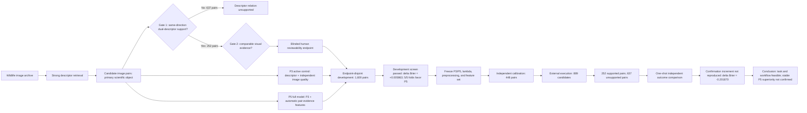

# PF-ERI v2 manuscript plan

Status: planning scaffold, not submission prose
Date: 2026-07-28

## Paper identity

This must be a new PF-ERI v2 manuscript. It must not overwrite or silently update the historical v1 manuscript at `paper/manuscript/main.md`.

Recommended paper type: methods and external-validation study with a transparently reported negative primary confirmation result.

Recommended working title:

> Similarity Is Not Admissibility: Development and Independent Evaluation of Pair-Level Evidence Admission for Wildlife Re-Identification

Alternative result-forward title:

> When Pair-Evidence Gains Do Not Transport: A Staged Evaluation of Reviewability in Wildlife Re-Identification

The first title is preferable for an ecology or applied-computer-vision audience because it foregrounds the scientific object. The second is preferable for a methods, validation, or negative-results venue.

## Central paper message

PF-ERI treats the image pair, rather than an isolated image or descriptor score, as the primary scientific object. It addresses two decisions that precede identity inference: whether two descriptors provide a supported relation for the candidate pair and whether the two photographs contain enough comparable visual evidence for responsible human review. The v2 study established a reproducible, dependency-aware development, calibration, and external-execution workflow. Adding pair-evidence features to descriptor similarity and independent image quality produced a small, directionally stable development-stage improvement, but that increment did not reproduce in the independent confirmation sample. The study therefore supports the pair-level task definition, the staged evaluation framework, and development feasibility, while leaving stable external superiority of the full P5 model unconfirmed.

The negative confirmation result is part of the main result, not a limitation to be hidden. The paper's contribution is that it separates a plausible and development-qualified evidence-admission mechanism from a transportable predictive claim.

## Scientific logic

## Research questions

The manuscript should answer four ordered questions.

1. Can reviewability be formalized as a pair-level evidence-admission endpoint distinct from descriptor similarity and identity truth?
2. Do automatic pair-evidence features add development-stage predictive information beyond descriptor similarity and independently measured image quality?
3. Can the frozen models, preprocessing, calibration, and pair measurements be executed reproducibly on an independent candidate queue?
4. Does the P5 development increment reproduce under the frozen primary comparison on independent confirmation outcomes?

The ordered answers are: yes as an operationally defined construct; yes within the Task15I development screen; yes for the supported Task15M execution path; and no for the observed independent confirmation comparison.

## Candidate innovations

These are contribution candidates, not priority or first-in-field claims. Their novelty must be checked against current literature before submission.

### 1. The image pair as the primary scientific object

The central conceptual contribution is to separate retrieval similarity, single-image quality, descriptor-relation support, visual pair comparability, and identity truth. A pair may be highly similar but visually non-comparable, while a different-identity pair may still be review-ready when visible evidence supports a responsible rejection. Neither endpoint image alone determines whether their relationship is usable evidence.

### 2. A two-gate pair framework

The external queue exposes two distinct pair-level gates. Gate 1 asks whether MegaDescriptor and DINOv2 provide the frozen same-direction top-20 consensus required by the P3/P5 descriptor taxonomy. Gate 2 asks whether the photographs provide sufficient comparable visual evidence for human review. In Task15M, 637 pairs failed Gate 1 and 252 entered the supported scoring path. This does not mean that all 637 were visually not review-ready; descriptor support and human reviewability must be analyzed separately.

### 3. A strictly nested active-control test of pair evidence

P3 contains descriptor similarity and independent image-quality information. P5 adds only the frozen automatic pair-evidence block. This design tests incremental information rather than comparing a full system with a weak descriptor-only baseline.

### 4. Dependency-aware evaluation for image-pair data

The development evaluation uses endpoint-disjoint graph components, and the confirmation interval accounts for shared physical image endpoints. This treats image pairs as a dependency graph instead of independent rows and directly addresses leakage and underestimated uncertainty.

### 5. Separation of development, calibration, execution validation, and outcome confirmation

The workflow prevents a successful software run or calibration fit from being reported as predictive confirmation. Models and calibration parameters are frozen before the independent outcome comparison, and the confirmation analysis is performed once on the supported subset.

### 6. Empirical demonstration of transport failure

The study documents how a small, stable development increment can fail after support restriction and a major endpoint-prevalence shift. This is a useful validation result for wildlife AI, where curated development samples and realistic candidate queues may differ sharply.

### 7. Support-aware reporting

The external queue is not silently reduced to analyzable cases. The paper retains all 889 candidates and explicitly reports 252 descriptor-supported and 637 descriptor-unsupported pairs. The frozen reason for all 637 is absence of same-direction dual-descriptor top-20 consensus, not an automatic-quality or local-match execution failure. This makes pair-level descriptor support part of the scientific result while keeping it distinct from human visual reviewability.

## Evidence backbone

| Stage | Scientific role | Frozen evidence | Result | Permitted interpretation |
| --- | --- | --- | --- | --- |
| Task15I | Independent redevelopment and component-disjoint development screen | 1,600 pairs; 400 endpoint-disjoint components | P3 Brier 0.194909; P5 Brier 0.189046; P3-P5 0.005863; 5/5 folds nonnegative | P5 passed the development screen |
| Task15J | Model freeze | P3 and P5; lambda 100; fixed preprocessing | Frozen | No later model reselection |
| Task15L | Independent apparent calibration | 448 pairs | Calibration procedure passed | Scoring form completed; not external validation |
| Task15M/15N | External execution validation | 889 candidate pairs; 815 images; 504 calibrated predictions | 252 met the frozen dual-descriptor pair taxonomy; 637 lacked same-direction top-20 consensus; execution audits passed | Reproducible execution and explicit pair-support boundary |
| Independent outcome analysis | Frozen primary comparison on Task15M supported pairs | 252 pairs; 357 unique endpoints | P3 Brier 0.307246; P5 Brier 0.509116; delta -0.201870; 95% CI -0.224671 to -0.179068 | Development increment did not reproduce |
| Project closure | Operational governance | Frozen closure record | `CONFIRMED/CLOSED` for Task15M execution validation | Engineering closure, not P5 superiority |

## IMRAD blueprint

### Introduction

The introduction should move through four paragraphs. First, establish that modern wildlife Re-ID descriptors can retrieve plausible candidates but that ecological use still depends on evidence quality and human review. Second, distinguish single-image quality and calibrated similarity from pair-level comparability across pose, flank, visible pattern, occlusion, and body region. Third, identify the methodological gap: animal Re-ID evaluation commonly emphasizes identity ranking, while the pre-identity evidence-admission decision and its dependency structure are less directly modeled. Fourth, state the PF-ERI objective and the four ordered research questions without predicting a positive result.

### Methods

Methods should be the longest and most reproducible section. It should describe the CzechLynx scope and licensing; candidate generation using the frozen descriptor queues; canonical unordered pairs; the two-gate distinction between descriptor-relation support and visual reviewability; the blinded reviewability endpoint; human-review workflow and adjudication; P3 and P5 feature boundaries; endpoint-graph partitioning; component-disjoint development folds; weighting; Brier score; the 0.005 minimum practical increment; model freeze; Task15L calibration; Task15M measurement support rules; the Hajek-normalized primary estimand; and the dyadic cluster-robust interval. Human-authorship attestations, excluded timestamps, and the major protocol deviation must be reported in a dedicated subsection rather than dispersed through footnotes.

### Results

Results should follow the chronological information boundary. Begin with sample flow and measurement support. Then report human endpoint distributions and agreement. Next report Task15I development performance and fold consistency. Report Task15L only as calibration completion. Present Task15M execution coverage before any performance result. End with the primary independent outcome comparison and its interval. The negative confirmation result should appear in the abstract, main Results, central results figure, and first Discussion paragraph.

### Discussion

The Discussion should open with the paired conclusion: development qualification was achieved, but independent superiority was not reproduced. It should then interpret why the task definition remains useful even though the chosen P5 implementation did not transport. The likely explanations to evaluate are endpoint-prevalence shift, calibration transport, support restriction, construct variability, and limited reliability in the Task15I labels. These are explanations and hypotheses, not post hoc proof. The section should compare PF-ERI with animal Re-ID descriptors, calibrated similarity fusion, biometric utility, visibility-aware Re-ID, and selective prediction. It should finish with the narrower supported contribution and the design requirements for a future v3 study.

## Figures

### Graphical abstract

A landscape graphical abstract should show: descriptor retrieval -> candidate pair -> reviewability assessment -> P3 versus P5 staged evaluation -> development gain -> independent non-reproduction -> bounded conclusion. It must visually distinguish identity retrieval from evidence admission.

### Figure 1: Scientific object and decision chain

Show the post-retrieval position of PF-ERI and the two pair-level gates: descriptor-relation support followed by visual-evidence admission. The final workflow may use three actions: admit to comparison, send to expert review, or defer. Use representative licensed image pairs only if publication rights permit.

### Figure 2: Prospective study flow

Show development, model freeze, calibration, external execution, support filtering, and one-shot outcome confirmation. Include pair counts, endpoint-disjoint design, and the prohibition on refitting.

### Figure 3: Development and confirmation contrast

Use a forest-style plot of P3-minus-P5 Brier differences. Display all five Task15I fold estimates, the pooled development estimate, the 0.005 threshold, and the independent confirmation estimate with its 95% interval. This should be the central empirical figure.

### Figure 4: Distribution and support shift

Compare endpoint prevalence across development, calibration, and confirmation, and show the 252/889 descriptor-supported fraction. Visually separate descriptor-taxonomy support from human `review_ready` status so that the 637 unsupported pairs are not misreported as 637 human-rejected pairs. A compact alluvial or aligned bar design can make both pair-level gates and the transport problem visible without implying causality.

### Optional Figure 5: Calibration transport

If row-level frozen predictions permit an auditable plot without refitting, show calibration curves or probability distributions for P3 and P5 across calibration and confirmation. This is descriptive and must not introduce new tuning.

## Tables

Table 1 should describe datasets, partitions, pair counts, endpoint counts, label construction, and information access. Table 2 should define P3 versus P5 predictors and the role of every feature family. Table 3 should report development and confirmation Brier results with exact estimands and intervals. Table 4 should be a claim-boundary matrix separating supported, unsupported, and prohibited interpretations. Reviewer-agreement and provenance details can be placed in a supplementary table if journal space is limited.

The expanded table architecture is frozen in `paper/manuscript/pferi_v2_table_plan.md`. It specifies six main tables, fourteen required supplementary tables, two optional extended audit tables, exact columns, evidence sources, interpretation boundaries, and production order.

## Required supplementary material

The supplement should contain the complete feature schema, split and component manifests, model coefficients, calibration parameters, execution environment, hashes, sampling weights, pair-support rules, reviewer instrument, adjudication rule, agreement analysis, sensitivity definitions, and a source-artifact map for every reported number. Raw restricted images and identity mappings should be handled through controlled access consistent with licenses and conservation sensitivity.

## Reporting framework

Use TRIPOD-style prediction-model reporting as the primary checklist, supplemented by STROBE elements for observational sample flow and provenance. A dedicated reproducibility checklist should record data roles, leakage prevention, software versions, fixed seeds, frozen hashes, missing-feature handling, and the one-shot confirmation rule. The exact applicable guideline versions and journal requirements must be verified before formatting the submission.

## Claim language

Preferred conclusion:

> PF-ERI v2 established a reproducible framework for pair-level evidence admission and identified a small, directionally stable development-stage contribution from automatic pair-evidence features. That contribution did not reproduce in the independent confirmation sample. The results support the scientific task definition and staged validation workflow, but do not establish stable external superiority of P5 over the descriptor-plus-quality control.

Avoid `validated`, `deployment-ready`, `identity accuracy improved`, `risk guaranteed`, and `P5 confirmed superior`. Operational `PASS` and `CONFIRMED` may be reported only with the explicit scope `Task15M execution validation`.

## Limitations that must be explicit

The paper must report the low Task15I reviewer agreement as a construct-measurement limitation without treating it as reviewer failure. It must disclose the retrospective human-authorship acceptance and major protocol deviation. It must report that only 252 of 889 external candidates had the complete supported measurement path. It must distinguish the large prevalence shift across stages from a demonstrated causal explanation. It must state that the study evaluates reviewability, not identity accuracy, field deployment utility, Bobcat transfer, or automatic identity assignment.

## Literature work before prose drafting

The existing source inventory already covers animal Re-ID, MegaDescriptor, WildFusion, wildlife benchmarks, biometric quality, visibility-aware Re-ID, reject-option learning, selective prediction, camera-trap review workflows, and graph-aware uncertainty. Before writing the Introduction and Discussion, refresh and verify the literature through 2026, prioritizing primary papers and checking every DOI, title, year, and claim. The novelty search must specifically test whether prior work has already defined pair-level evidence admissibility or reviewability distinct from identity performance.

## Writing order

1. Freeze the paper-facing evidence and source-data map.
2. Generate Figures 2-4 and Tables 1-4 from frozen artifacts.
3. Write Methods in full prose.
4. Write Results directly from the display items.
5. Refresh and verify the literature, then write the Introduction and Discussion.
6. Write the abstract, title, graphical abstract, data availability, ethics, contributions, funding, and competing-interest statements last.
7. Run a claim audit, numerical cross-check, citation audit, figure audit, and journal-guideline checklist before submission formatting.

## Immediate next action

The paper-facing v2 source-data manifest is complete at `paper/supplement/source_data/pferi_v2/`. The next implementation step is to generate the two central result displays: the prospective study-flow diagram and the development-versus-confirmation Brier comparison. No model coefficient or Task15L calibration parameter needs to be recalculated.
