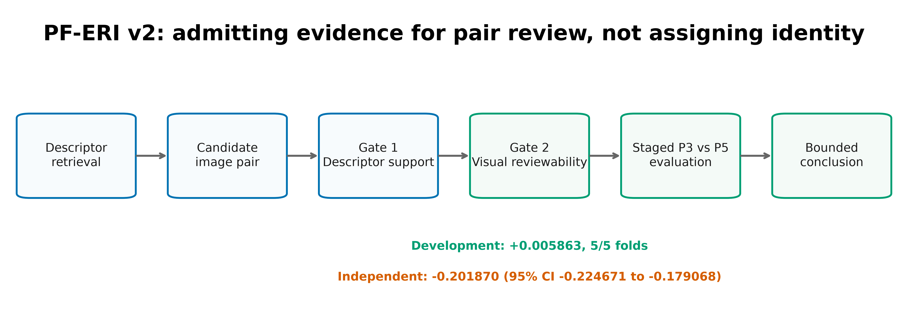

# An auditable pair-level evidence admission framework for wildlife re-identification: development and independent evaluation of PF-ERI v2

Manuscript status: complete scientific rewrite
Evidence cutoff: frozen PF-ERI v2 evidence package through project closure
Reporting orientation: TRIPOD-style prediction-model reporting with STROBE elements for sample flow and provenance

## Abstract

Wildlife re-identification systems retrieve candidate matches, but rank alone cannot show whether two photographs contain enough shared evidence for responsible human review. I developed Pairwise Felid Evidence Reviewability Index version 2 (PF-ERI v2) to evaluate this pair-level question after retrieval. I separated descriptor support, human visual reviewability, and identity truth. I compared a descriptor-plus-image-quality control model (P3) with its strict extension containing local pair evidence (P5). I developed both models on 1,600 reviewed pairs in 400 endpoint-disjoint components, froze them at lambda 100, calibrated them on 448 independent pairs, and scored 889 external candidates while outcomes remained sealed. P5 reduced weighted development Brier from 0.194909 to 0.189046. The P3-minus-P5 increment was 0.005863, and all five folds favored or tied P5. The external descriptor gate supported 252 pairs and excluded 637 that lacked same-direction dual-descriptor top-20 consensus. I analyzed the supported pairs once with frozen calibrated predictions and a dyadic interval based on shared image endpoints. P3 achieved a weighted Brier score of 0.307246, compared with 0.509116 for P5. The difference was -0.201870 (95% interval, -0.224671 to -0.179068), so P5 failed the prespecified independent criterion. PF-ERI v2 defines an auditable reviewability task from evidence definition through external evaluation. The independent result limits the tested local-evidence specification and narrows the next test to shared anatomy and body-side compatibility. I did not evaluate identity accuracy or deployment utility.

Keywords: animal re-identification; camera traps; evidence admission; image pairs; reviewability; selective prediction; wildlife monitoring

## Introduction

Camera traps produce large image collections under uncontrolled field conditions. Viewpoint, body side, occlusion, distance, and illumination vary across encounters. Animal re-identification systems search these collections for photographs of the same individual. General descriptors, open-source toolkits, calibrated fusion methods, and multi-species benchmarks have strengthened this retrieval step (Schneider et al., 2019; Vidal et al., 2021; Cermak et al., 2024a; Adam et al., 2025). Human reviewers still decide whether a retrieved pair supports an identity judgment.

### Research origin and problem formulation

I began this research by seeking a way to connect my interests in animals and computing. After contacting a professor at a local university, I obtained an opportunity to volunteer with the Urban Wildlife Information Network (UWIN), where I classified camera-trap photographs. As a volunteer, I performed the same review step that wildlife-computing systems aim to support. I could often recognize the species in a photograph while remaining unable to determine whether two photographs showed the same individual.

Viewpoint created the recurring problem. The same animal could look different in left, right, frontal, and rear views, and occlusion or partial body coverage reduced the shared evidence. Two sharp photographs could expose different flanks or body regions and provide no responsible basis for comparison. I investigated this problem across animal Re-ID, image-quality assessment, metric learning, and human-review workflows. Strong descriptors addressed candidate similarity and identity ranking, while single-image readiness could not resolve whether two photographs contained comparable evidence. I reformulated the scientific object from an isolated image to an image pair and asked whether that pair was reviewable before anyone used it for an identity decision.

Retrieval rank and evidential value answer separate questions. A model may rank two images close together because they share color, pose, or background. A reviewer may find little common anatomy or pattern to compare. Two sharp images can also form a weak pair when they show opposite flanks or different body regions. These conditions arise at the relation between photographs, so single-image quality cannot describe them on its own.

Errors at this stage can enter encounter histories and conservation analyses. Field studies of large felids rely on defensible individual assignments, and conservation researchers have documented how classification errors affect ecological inference (Tuia et al., 2022; Pereira et al., 2022; Whytock et al., 2021). Work on controlled error rates and human oversight addresses part of this risk (Villon et al., 2020). Most published systems evaluate species labels, identity retrieval, or downstream estimates. They seldom treat the reviewability of a retrieved image pair as the primary outcome.

I drew on three adjacent fields. Biometric quality research links image properties to recognition utility (Schlett et al., 2022). Visibility-aware person re-identification models common visible regions under occlusion (Yang et al., 2021). Reject-option learning and conformal risk control study abstention under explicit loss and calibration conditions (Geifman and El-Yaniv, 2019; Hendrickx et al., 2024; Angelopoulos et al., 2024). Animal Re-ID fusion methods combine global descriptors with local matching (Cermak et al., 2024b). I used these concepts to define a wildlife workflow in which the system assesses whether a candidate pair contains comparable visual evidence before a person uses it for identity review.

I designed PF-ERI v2 around the image pair. The first gate tested whether MegaDescriptor and DINOv2 supported the same candidate relation within frozen top-20 retrievals. The second gate used independent human judgments of visual reviewability. Identity truth lay outside the study endpoint. A reviewer can reject a different-individual pair with confidence when the pair exposes enough visual evidence; the pair still qualifies as review-ready.

I tested three questions. First, did local pair evidence improve probabilistic reviewability prediction over a descriptor-plus-quality control during independent development? Second, could I freeze, calibrate, and execute both models on an external queue without reading outcomes or changing the models? Third, did the development increment survive a one-shot independent comparison that accounted for photographs reused across pairs? I separated these stages so the development signal, execution feasibility, and transport result could each guide the next model iteration.

## Methods

### Study design and pair-level endpoint

I organized the study into development, model freeze, calibration, external execution, independent outcome analysis, and operational closure (Figure 2; Table 1). I fit models within endpoint-disjoint development folds. At freeze, I locked predictors, preprocessing, coefficients, and regularization. During calibration, I fit one intercept and one slope for each frozen model. During external execution, I measured features and scored pairs while outcomes remained sealed. I opened the external outcomes once after the prediction file had passed its audits.

I used an unordered image pair as the analysis unit and distinguished five constructs (Figure 1; Table 2). Technical image quality indicated whether each photograph could support automatic measurement. Directed descriptor ranks quantified retrieval strength, and descriptor support captured agreement between two retrieval systems. Human reviewability represented whether reviewers saw enough comparable evidence for responsible comparison. Identity truth indicated whether the photographs depicted the same individual; I did not model that outcome.

I used the descriptor gate to classify pairs as `both_reciprocal`, `both_agreement`, or unsupported. A `both_reciprocal` pair appeared within the top 20 in both directions for both descriptors. A `both_agreement` pair received same-direction top-20 support from both descriptors without meeting the reciprocal rule. I assigned unsupported pairs the frozen reason `no_same_direction_dual_descriptor_top20_consensus`. The two supported categories entered the model-scoring path.

### Human review and outcome construction

Four independent reviewers assessed image pairs with a three-category instrument. They selected `review_ready`, `not_review_ready`, or `uncertain` and recorded reason codes, confidence, and any technical problem. The review-ready label meant that the pair exposed enough comparable visual evidence for responsible review. It did not encode a same-individual decision.

I defined the model target as the probability of `not_ready_or_uncertain`. I assigned 0 to pairs that met the frozen review-ready rule and 1 to all other eligible combinations. This mapping sent unresolved evidence away from automatic admission. I used reason codes and confidence for description and excluded submission timestamps from eligibility, cost calculations, and statistical analysis.

Each pair in the formal external sample received two first-pass reviews. I retained exact agreements and sent categorical disagreements to fresh blinded adjudication. I calculated three-category exact agreement, binary agreement, and Cohen's kappa for each study stage. The kappa calculation used the review-ready versus not-ready-or-uncertain mapping (Tables S3 and S4).

Four retrospective reviewer attestations supported human authorship of the retained decisions, reason codes, and confidence fields. I left the source files unchanged. I also documented a major protocol deviation: collection began before the recorded release gate had cleared, the browser audit covered an earlier application hash, and the timestamp pattern conflicted with the supplied application writer. I retained the human decisions after adjudication, excluded timestamps, and report the deviation with the analysis.

### Models and preprocessing

I specified P3 as the active control with MegaDescriptor and DINOv2 within-role percentiles, descriptor-support category, and the minimum endpoint percentiles for native pixel count, sharpness, and exposure. P3 also included endpoint quality-failure and quality-stress states. I specified P5 as the full P3 design plus local-match coverage and explicit local-match failure states (Table 4; Tables S6 and S7).

I fit both models with ridge logistic regression, an unpenalized intercept, and lambda 100. Within each training fold, I imputed continuous missing values with the training median, centered each feature by the training mean, and divided by the training population standard deviation. I added a missing indicator for each continuous feature and encoded categorical features with frozen one-hot columns for missing and unknown levels. I represented failed local matching as a failure state rather than a zero coverage value.

### Development and qualification rule

The development sample contained 1,600 pairs from 400 endpoint-image connected components. Each component contributed four pairs. I assigned whole components to five outer folds, which prevented a physical image from appearing in both training and validation data. Each validation fold contained 320 pairs from 80 components. The leakage audit found zero shared endpoints across all five splits (Table S5).

I compared P3 and P5 with normalized inverse-square-root first-order inclusion-probability weights. The primary development statistic, weighted Brier(P3) minus weighted Brier(P5), assigned positive values to a P5 advantage because lower Brier scores indicate better probability predictions. The frozen qualification rule required a pooled increment of at least 0.005 and a nonnegative increment in at least four outer folds. I selected lambda through outcome-free simulation before analyzing the human development labels and did not retune it across folds.

### Calibration

The calibration sample contained 448 independent double-reviewed pairs. I applied the frozen P3 and P5 models to each pair and fitted the permitted transform

`logit Pr(y=1) = calibration intercept + calibration slope x logit(raw frozen probability)`.

I clipped raw probabilities to the interval from 10^-12 to 1 minus 10^-12 before taking logits. I changed no feature, preprocessing value, coefficient, or penalty during calibration. I performed no model selection and created no action threshold. I required both outcome classes, converged fits, finite parameters, and calibrated probabilities within the unit interval, then completed 2,000 bootstrap replicates (Table S8).

### External execution and descriptor support

The external queue contained 889 candidate pairs formed from 815 images. I generated current MegaDescriptor-L-384 and DINOv2-ViT-L/14 embeddings and directed top-20 scores under the frozen execution contract. I used the descriptor gate to determine which pairs received image-quality aggregation, local-match measurement, frozen P3/P5 scoring, and the stored calibration transforms.

I checked image counts, manifest rows, embedding shapes, L2 normalization, file hashes, failure codes, score-input rows, and prediction counts. A supported record required one descriptor classification, endpoint-quality measurements, one local-match row, and calibrated probabilities from both models. The execution code could not read human outcomes. I ran a separate validation audit on the returned package before outcome linkage (Tables S9 and S10).

### Independent outcome analysis

I restricted the independent comparison to the 252 descriptor-supported external pairs. For each pair and model, I computed squared error between the frozen calibrated probability and the accepted binary outcome. I then estimated the Hajek-normalized inverse-probability-weighted mean of Brier(P3) minus Brier(P5).

Photographs appeared in more than one pair. I estimated a two-sided 95% dyadic cluster-robust sandwich interval with the original physical image identifiers as dyad members. The prespecified criterion required the lower interval endpoint to exceed 0.005. I ran the outcome analysis once and reused the frozen model coefficients and stored calibration parameters without recalculation. I retained an independent-row standard error as a diagnostic and based the primary inference on the dyadic interval (Table S12).

### Reproducibility and claim control

I linked each manuscript claim to frozen CSV or JSON evidence through a source manifest. The manifest checked SHA-256 hashes, row counts, and cross-stage scientific invariants. Deterministic builders generated six main tables, sixteen supplementary tables, and six figure sets. Automated tests checked headline numbers, descriptor-gate denominators, reviewer agreement, and prohibited claim extensions. The repository stores editable CSV and Markdown tables plus PNG, SVG, and PDF figures (Tables S14 and S16).

## Results

### Pair flow and human outcomes

Development included 1,600 pairs in 400 components. Reviewers classified 448 pairs (28.0%) as review-ready under the frozen binary rule and 1,152 (72.0%) as not-ready-or-uncertain. The calibration sample contained 86 review-ready pairs (19.2%) and 362 not-ready-or-uncertain pairs (80.8%) among 448 pairs (Table 3; Figure 4).

The external queue contained 889 pairs. The final human outcomes classified 712 pairs (80.1%) as review-ready and 177 (19.9%) as not-ready-or-uncertain. The descriptor-supported subset contained 218 review-ready pairs (86.5%) and 34 not-ready-or-uncertain pairs (13.5%). Human reviewers classified 494 of the 637 descriptor-unsupported pairs as review-ready. The descriptor gate therefore selected a relation defined by retrieval consensus rather than the human endpoint.

### Reviewer agreement and provenance

Development reviewers gave the same three-category decision for 661 of 1,600 pairs (41.3%). They agreed on the binary outcome for 855 pairs (53.4%), which produced a kappa of 0.0787. Calibration reviewers reached three-category agreement for 341 of 448 pairs (76.1%) and binary agreement for 413 pairs (92.2%); binary kappa was 0.7802. External reviewers reached three-category agreement for 805 of 889 pairs (90.6%) and binary agreement for 832 pairs (93.6%); binary kappa was 0.8049. Adjudicators resolved 84 external categorical disagreements (Table S4).

Development reviewers differed often when applying the reviewability construct. I retained those differences in the binary target through the frozen mapping. Calibration and external reviewers reached higher agreement. The human-authorship disposition accepted the reviewer decisions after attestation and preserved the major protocol deviation in the evidence record (Table S13).

### Development and model freeze

P3 produced a pooled weighted development Brier score of 0.194909. P5 produced 0.189046. Their difference, Brier(P3) minus Brier(P5), was 0.005863 and exceeded the 0.005 development threshold. Every outer fold produced a nonnegative difference, so P5 met the fold-direction requirement (Table 5; Table S5; Figure 3).

I froze P3 and P5 at lambda 100 after qualification. The P5 matrix contained the P3 columns followed by five local pair-evidence columns. I locked feature definitions, preprocessing, coefficients, and regularization before calibration and external execution.

### Calibration

The calibration sample included 86 outcome-0 pairs and 362 outcome-1 pairs. P3 had a stored calibration intercept of -4.10791542893 and a slope of 5.57298280202. P5 had an intercept of -3.16449012869 and a slope of 4.38560914488. Both fits converged, and every calibrated probability fell within the unit interval. I completed all 2,000 bootstrap replicates. I changed neither model and made no external performance comparison during calibration (Table 5; Table S8).

### External execution

The descriptor gate supported 252 of 889 candidates (28.3%). This group included 109 `both_reciprocal` pairs and 143 `both_agreement` pairs. The gate assigned 637 candidates (71.7%) the reason `no_same_direction_dual_descriptor_top20_consensus` (Table S9; Figure 4).

The execution package verified all 815 images. MegaDescriptor and DINOv2 outputs passed shape, normalization, row-count, and hash checks. Each supported pair had one local-match measurement, and no supported local-match row carried a failure code. The package contained 504 calibrated predictions, one P3 and one P5 value for each supported pair. The outcome-free execution audit and its validation audit both passed (Table 5; Table S10).

### Independent model comparison

The independent analysis covered 252 supported pairs and 357 physical image endpoints. One image appeared in as many as seven pairs. P3 achieved a Hajek-weighted Brier score of 0.307246; P5 achieved 0.509116. The P3-minus-P5 estimate was -0.201870, and the dyadic 95% interval ranged from -0.224671 to -0.179068 (Table 5; Table S12; Figure 3).

The full interval lay below zero and below the required lower bound of 0.005. P5 failed the independent criterion. The external result favored P3 despite the small P5 advantage observed across development folds.

### Study disposition

I defined pair-level reviewability, froze the nested models, completed calibration, and executed the supported external path under audit. The project record used `CONFIRMED/CLOSED` within the external execution-validation scope, which covered measurement integrity and scoring coverage. The independent comparison did not support P5 superiority and bounded the tested specification (Table 6).

## Discussion

I carried PF-ERI v2 from a pair-level evidence definition through independent evaluation under audit. P5 passed the development rule with consistent fold direction, which indicated a small local-evidence signal within the endpoint-disjoint development design. In the external comparison, P3 had the lower weighted Brier score by 0.201870. The dyadic interval excluded sampling uncertainty as an explanation for the reversal. These findings reject the tested P5 specification and isolate its local pair-evidence features for redevelopment.

PF-ERI adds a measurement between candidate retrieval and identity review. MegaDescriptor, DINOv2, WildlifeDatasets, and WildlifeReID-10k address representation and benchmark evaluation (Oquab et al., 2023; Cermak et al., 2024a; Adam et al., 2025). WildFusion calibrates and combines identity-similarity signals (Cermak et al., 2024b). PF-ERI asks whether a person can compare the retrieved photographs with enough shared visual evidence. Human reviewers called 77.6% of descriptor-unsupported pairs review-ready, so descriptor consensus could not substitute for the human endpoint. Pair-level reviewability gives systems a measurable target for supporting human identity review after retrieval.

Biometric quality and visibility-aware Re-ID offer the closest technical analogies. Quality models estimate recognition utility for a sample, while visibility-aware models compare shared regions under occlusion (Schlett et al., 2022; Yang et al., 2021). Wildlife imagery adds side-specific pattern evidence and large pose changes. Pair reviewability makes these relational conditions observable. The external comparison shows that local-match coverage did not transport in the tested model. The next specification can test common visible region, body-side compatibility, and alignment of pattern evidence by body region.

Reject-option learning provides a workflow analogy. A system can admit a pair, send it to an expert, or defer it. Selective prediction research evaluates such choices through risk and coverage (Geifman and El-Yaniv, 2019; Hendrickx et al., 2024). I measured descriptor-gate coverage and prediction loss. Researchers can add a risk-coverage operating curve after defining a deployment loss and drawing a representative calibration sample. Conformal risk control offers one method for that extension (Angelopoulos et al., 2024).

Four measured shifts offer candidate explanations for the external reversal, although the experiment cannot separate their effects. Review-ready prevalence rose from 28.0% in development to 86.5% in the supported external subset. The descriptor gate restricted the external comparison to 252 of 889 candidates, which compressed the range of eligible relations. Stored calibration transforms came from another sample, and development reviewers showed low agreement. Each difference could change the learned probability function or its loss after transport. New data that balance prevalence and descriptor-support strata can test these explanations.

Reviewer disagreement makes outcome definition the first target for redevelopment. Reviewers agreed on the binary outcome for 53.4% of development pairs, with kappa 0.0787. The conservative target encoded uncertainty and reviewer disagreement as non-admission. P5 may have learned a mixture of visual reviewability and reviewer discordance. Calibration and external reviewers agreed at higher rates, which changed the effective target even though the written rule stayed fixed. Disagreement-focused pilots, sharper visual anchors, and a prespecified model of reviewer effects can produce a more stable target in the next study.

I reduced optimism in the main comparison by keeping whole endpoint components within folds and assigning P3 and P5 the same model family and penalty. I froze both models before calibration and kept outcomes sealed during external measurement. I ran the independent analysis once and used image endpoints for its variance estimate. Hashes and deterministic builders preserved both the development signal and the external reversal. Researchers can evaluate a revised relational model under the same comparison.

Two limitations constrain the result. The descriptor gate withheld predictions from 71.7% of the external queue, so the primary comparison describes a selected subset. The human data also carry a major provenance deviation that retrospective attestations cannot remove. Beyond those constraints, the study measured reviewability rather than identity accuracy, review time, encounter-history validity, or conservation outcomes. It supplied no transfer test for Bobcat imagery.

A new study can retain the pair-level endpoint and replace the present P5 specification. Researchers can refine the review instrument with pairs that produced disagreement, then collect a fresh development sample under the final release and audit process. A small prespecified set of relational features, including common visible region and side compatibility, can enter the same nested comparison against P3. Calibration and confirmation sampling should reflect the expected external prevalence and descriptor-support mix. Treating coverage as an outcome would capture the cost of deferring candidates at the descriptor gate.

Authors should report transport results with the same detail as development gains in conservation machine learning. Model errors can affect ecological inference, and human reviewers need a visible evidence chain (Tuia et al., 2022; Villon et al., 2020; Whytock et al., 2021). PF-ERI v2 supplies a defined reviewability endpoint, a stage-separated evaluation design, and an external result that identifies the features requiring redevelopment. Researchers can reuse these elements to test pair-level assistance in wildlife re-identification.

## Conclusion

PF-ERI v2 defines visual reviewability as a measurable property of a retrieved wildlife image pair. I connected that endpoint to an audited development, calibration, and external evaluation workflow. P5 achieved a small gain across endpoint-disjoint development folds, while the independent supported-pair analysis favored P3 and rejected the current P5 specification. Researchers can now test revised relational features against the frozen control with the same validation procedure. I did not assess identity accuracy, deployment utility, or automatic identity assignment.

## Data and code availability

The repository contains the frozen model and calibration records, hash-bound evidence manifests, deterministic display builders, tests, editable tables, and figure source files. The manuscript evidence map resides in `paper/supplement/source_data/pferi_v2/`. Main and supplementary tables reside in `paper/tables/pferi_v2/`, and figures reside in `paper/figures/pferi_v2/`. The manuscript package excludes restricted images, sensitive locations, and identity linkage. Source licenses and conservation restrictions govern access to those materials. The author will add a public repository URL and controlled-access procedure before submission.

## Ethics statement

The study used existing wildlife photographs, derived pair measurements, and human review responses. The author did not capture, handle, or intervene with live animals. Dataset licenses and conservation restrictions govern image access. The manuscript reports reviewers through pseudonymous codes and aggregate statistics. The author will record the applicable institutional determination for secondary image analysis and reviewer participation before submission.

## Author contributions

The sole author completed the conceptualization, methodology, software, validation, formal analysis, investigation, resource management, data curation, visualization, project administration, original drafting, and manuscript revision. The author approved the manuscript and accepts responsibility for the work.

## Acknowledgements

The author thanks four independent reviewers who completed the blinded pair-level visual assessments. They contributed human review decisions and did not take part in study conception, model development, statistical analysis, interpretation, or manuscript authorship. The manuscript identifies them through pseudonymous codes and aggregate statistics.

## Funding

This research received no external funding.

## Competing interests

The author declares no competing interests.

## References

Adam, L., Cermak, V., Papafitsoros, K., and Picek, L. (2025). WildlifeReID-10k: Wildlife re-identification dataset with 10k individual animals. *Proceedings of the IEEE/CVF Conference on Computer Vision and Pattern Recognition Workshops*. https://doi.org/10.1109/CVPRW67362.2025.00197

Angelopoulos, A. N., Bates, S., Fisch, A., Lei, L., and Schuster, T. (2024). Conformal risk control. *International Conference on Learning Representations*. https://proceedings.iclr.cc/paper_files/paper/2024/file/f3549ef9b5ff520a7e41ff3cc306ab2b-Paper-Conference.pdf

Cermak, V., Picek, L., Adam, L., and Papafitsoros, K. (2024a). WildlifeDatasets: An open-source toolkit for animal re-identification. *Proceedings of the IEEE/CVF Winter Conference on Applications of Computer Vision*. https://doi.org/10.1109/WACV57701.2024.00585

Cermak, V., Picek, L., Adam, L., Neumann, L., and Matas, J. (2024b). WildFusion: Individual animal identification with calibrated similarity fusion. *arXiv*. https://doi.org/10.48550/arXiv.2408.12934

Geifman, Y., and El-Yaniv, R. (2019). SelectiveNet: A deep neural network with an integrated reject option. *Proceedings of Machine Learning Research, 97*, 2151-2159. https://proceedings.mlr.press/v97/geifman19a.html

Hendrickx, K., Perini, L., Van der Plas, D., Meert, W., and Davis, J. (2024). Machine learning with a reject option: A survey. *Machine Learning*. https://doi.org/10.1007/s10994-024-06534-x

Oquab, M., Darcet, T., Moutakanni, T., Vo, H., Szafraniec, M., and others. (2023). DINOv2: Learning robust visual features without supervision. *arXiv*. https://doi.org/10.48550/arXiv.2304.07193

Pereira, K. S., Gibson, L., Biggs, D., Samarasinghe, D., and Braczkowski, A. (2022). Individual identification of large felids in field studies: Common methods, challenges, and implications for conservation science. *Frontiers in Ecology and Evolution, 10*, 866403. https://doi.org/10.3389/fevo.2022.866403

Schlett, T., Rathgeb, C., Henniger, O., Galbally, J., Fierrez, J., and Busch, C. (2022). Face image quality assessment: A literature survey. *ACM Computing Surveys, 54*(10s). https://doi.org/10.1145/3507901

Schneider, S., Taylor, G. W., Linquist, S., and Kremer, S. C. (2019). Past, present and future approaches using computer vision for animal re-identification from camera trap data. *Methods in Ecology and Evolution, 10*(4), 461-470. https://doi.org/10.1111/2041-210X.13133

Tuia, D., Kellenberger, B., Beery, S., Costelloe, B. R., Zuffi, S., and others. (2022). Perspectives in machine learning for wildlife conservation. *Nature Communications, 13*, 792. https://doi.org/10.1038/s41467-022-27980-y

Vidal, M., Wolf, N., Rosenberg, B., Harris, B. P., and Mathis, A. (2021). Perspectives on individual animal identification from biology and computer vision. *Integrative and Comparative Biology, 61*(3), 900-916. https://doi.org/10.1093/icb/icab107

Villon, S., Mouillot, D., Chaumont, M., Subsol, G., Claverie, T., and Villeger, S. (2020). A new method to control error rates in automated species identification with deep learning algorithms. *Scientific Reports, 10*, 10972. https://doi.org/10.1038/s41598-020-67573-7

Whytock, R. C., Swiezewski, J., Zwerts, J. A., Bara-Slupski, T., Pambo, A. F. K., and others. (2021). Robust ecological analysis of camera trap data labelled by a machine learning model. *Methods in Ecology and Evolution, 12*(6), 1080-1092. https://doi.org/10.1111/2041-210X.13576

Yang, J., Zhang, J., Yu, F., Jiang, X., Zhang, M., Sun, X., Chen, Y.-C., and Zheng, W.-S. (2021). Learning to know where to see: A visibility-aware approach for occluded person re-identification. *Proceedings of the IEEE/CVF International Conference on Computer Vision*. https://doi.org/10.1109/ICCV48922.2021.01167
